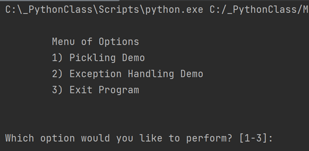

Thomas Nord  
08-22-2022  
Foundations of Programming (Python)  
Recap of Module 07 – Files and Exceptions  
[https://github.com/nordthomas/IntroToProg-Python-Mod07](https://github.com/nordthomas/IntroToProg-Python-Mod07)  

# Pickling and Exceptions  

## Introduction
In this week’s lesson we learned more about working with files, specifically working with data files. We learned what pickling is and how to use it to convert objects to byte streams. We also learned about structured error handling and using exceptions with a `try-except` block. Our assignment this week tasked us with creating a script that demonstrates how both pickling and structured error handling work. 

## Pickling
Pickling, also known as serializing/deserializing, is a process in Python where an object is converted to (or from) a byte stream. This can be useful for doing things like saving the program’s state, storing information for use in a database, or when transferring files over a network.

Pickle is a module in Python that must be imported into your program before you can use it. So, we start our script with the import statement. 

    import pickle

For my demo script this week I started with a basic menu that asks the use which demo they would like to try (Figure 1). 

***Figure 1: The demo menu***

The code for this menu is a slightly modified version of the menu we used for Assignment 06. I built the menu and the user’s choice in to functions and called those functions inside of a `while` loop: 

    while (True):
        IO.output_menu_demo()  # Shows menu
        str_main_choice = IO.input_main_menu_choice()  # Get menu option

If the user chooses the Pickling Demo I present a second menu where they can choose to Pickle or Un-pickle data (Figure 2).

***Figure 2: Pickle menu***

I set up a nested `while` loop and used the same approach to the main menu to create the pickle menu. If a user chooses the Pickle Data option I ask them to provide some data that we can pickle. In a callback to our first assignment I ask for their first and last name. 

    print("First, we'll need some data to pickle.")
    lst_pickle_data = IO.input_pickle_data()

The main difference this time is that I’m calling a custom function to gather the user’s input and add it to a list. 

    @staticmethod
    def input_pickle_data():
        """ Gets user data to be pickled
    
        :return: list
        """
        strFirstName = str(input("What is your First Name? "))
        strLastName = str(input("What is your Last Name? "))
        lstName = [strFirstName, strLastName]
        return lstName
        
Once I have a list, we’re ready to pickle. I call another custom function with arguments for the name of the file I want the data written to and what data I want picked, in this case, our newly generated list. 

    Processing.save_data_to_file(FILENAME, lst_pickle_data)

The function we are calling here uses the `open` function to open our file and because we are using the `write` mode it will create the file if it doesn’t already exist on disk. Because we are writing a byte stream now instead of strings of text we need to use the “`wb`” mode, which allows us to write to a binary file. 

    @staticmethod
    def save_data_to_file(file_name, list_of_data):
        """ Writes data from a list of rows to a File
    
        :param file_name: (string) with name of file:
        :param list_of_data: (list) you want filled with file data:
        """
        objFile = open(file_name, "wb")
        pickle.dump(list_of_data, objFile)
        objFile.close()
        
The `dump` method will then take our list and convert it to a byte stream and write it to the binary file. We’ll use the `close` method to then close the file. 

After pickling the data we’ll display it back to the user in its pickled for so they can see what it looks like (Figures 3.1 & 3.2).

***Figures 3.1 & 3.2: Pickled data***

To complete our demo of pickling we need to demonstrate to the user what un-pickling looks like. The code for the Un-pickle Data option is pretty straightforward. We start by calling another custom function, this one for reading binary data. 

    print("Here is the data from your file:\n")
    Processing.read_data_from_file(FILENAME)
    print("\nYour data has been un-pickled!")

When we look at the function itself it takes one argument, the name of the file to read from, and then opens the file. We declare a variable that we want to read the data in to and then assign the `pickle.load` method to it. This will convert our byte stream data into a list that we can then display to the user (Figure 4).

    @staticmethod
    def read_data_from_file(file_name):
        """ Reads binary data from a file
    
        :param file_name: (string) with name of file:
        """
        objFile = open(FILENAME, "rb")
        objFileData = pickle.load(objFile)  # load() only loads one row of data.
        print(objFileData)
        objFile.close()
 

***Figure 4: Our un-pickled list***

Once the user has completed the demo they can select option 3 to return to the main menu. 
Pickling is a really handy want to store binary data but it is not without its pitfalls. If you work with pickled data you need to be mindful that: 

1. The data is obscured, but not secured. This means that some of the data may appear as it if it were plain text. You can see a good example of this in Figures 3.1 & 3.2.
2. Because the data can be obscured it is important to make sure you trust the source of the pickled file as it is very easy to hide malicious code inside of such files and there is no way to know until it is too late. 
Now let’s see it all put together (Figures 5.1 & 5.2).
  

***Figures 5.1 & 5.2: Our pickling demo running in the shell***

## Structured Error Handling
Structured error handling is a great way to manage errors in your Python program. When a user triggers a condition that would throw an error you can use exceptions to catch those errors and return customized error messages that will allow the user to better understand the problem than the built-in error handling. This can be much more useful than when you don’t have any sort of error handling implemented in your program (Figure 6). 

***Figure 6: Without structured error handling***

In this example I attempt to divide by zero without structured error handling and I get an error that is maybe helpful to me as the developer, but this is of no real use to my users. Even worse, it stops the script from running entirely. Instead, I can wrap my code in a try-except block and not only catch the error and provide helpful information, but the script will keep running. To demonstrate this I’ve written a little loop that asks the user to input a letter. If the user adds any input that is not a letter, it will trigger my except block and they will receive an error message (Figure 7). 
 

***Figure 7: Custom error messaging***

That’s much better because the user has a chance to continue working without restarting the program and they have a user-friendly message indicating the source of the error. Let’s look at the code.

    while(True):
        try:
            str_letter = input("Please enter a letter: ")
            if str_letter.isalpha():
                continue
            else:
                print("\nThat's not a letter!")
    
        except:
            print("\nPlease only use letters.")
    
        break
    
When we expect there may be an area of our code that could experience errors, we can wrap it in a `try` block. Then, if an error is encountered it will move on to the `except` block to handle that error. In this case we print an error message. The downside is that as a developer this may not give me enough information about the problem. We can have the best of both solutions by using the Exception class. 

The Exception class is a built-in class that contains all the information about a bunch of errors a user may encounter. With the Exception class we can provide information about the encountered error that is helpful to both the user and the developer. Let’s try that again but this time utilizing the Exception class (Figure8).

***Figure 8: The Exception class provides more information***

If we look at the code we see that nothing has changed in our try block, but our except block calls the Exception class and stores the returned information in the variable `e`. Using that variable we can display the exception type (`type(e)`), the docstring of the exception(`e.__doc__`), and the error string (`e.__str__()`).

    while(True):
        try:
            str_letter = input("Please enter a letter: ")
            if str_letter.isalpha():
                continue
            else:
                raise Exception
    
        except Exception as e:
            print("\nThere was a user error!")
            print("Built-in Python error info: ")
            print(e)
            print(type(e))
            print(e.__doc__)
           print(e.__str__())
    
        break
    
But what if the built-in error messaging isn’t good enough? For example, the error messaging in the above example is pretty vague. Since we have the ability to expand the exception class with our own custom exception class, we can add whatever information we want to our error message. Let’s see how that might look (Figure 9).
  

***Figure 9: Our custom exception class***

Our code for the try-except block largely remains the same, though for this particular demo I went with a different user interaction. Here I’m asking the user for a letter and if I receive any input other than a letter we’ll throw the exception with a `raise` statement. 

    try:
        str_letter = input("Please enter a letter: ")
        if str_letter.isalpha():
            continue
        else:
            raise NotALetter()
    
    except Exception as e:
        print("\nThere was a user error!")
        print("Custom Python error info: ")
        print(e)
        print(type(e))
        print(e.__doc__)
        print(e.__str__())
    
You’ll see that the `except` block is pretty much the same as it was with the built-in Exception class, we’ve just changed the `print` statement to reflect that we’re using a custom error message. The real power here is in the custom class code: 

    class NotALetter(Exception):
        """  Check to see if entry is a letter.  """
        def __str__(self):
            return 'Entry is not a letter.'
        
We’ve named our custom class (`NotALetter`) and given it a custom doc string which can provide important details to other developers. We’ve also set up a string for the class to return when triggered so the user will know why they encountered the error. 

The last thing to do is load our program up in to Command Line to make sure it is all working there (Figure 10).
 

***Figure 10: Our demo in Command Line***

## Summary
I’ve shown you how to pickle your objects in Python and a bit about why that might be useful. I’ve also demonstrated the proper way to utilize a try-except block in your script to catch user errors and provide more clarity about the errors they may face. 

Link to my published page: [https://github.com/nordthomas/IntroToProg-Python-Mod07](https://nordthomas.github.io/IntroToProg-Python-Mod07/)
